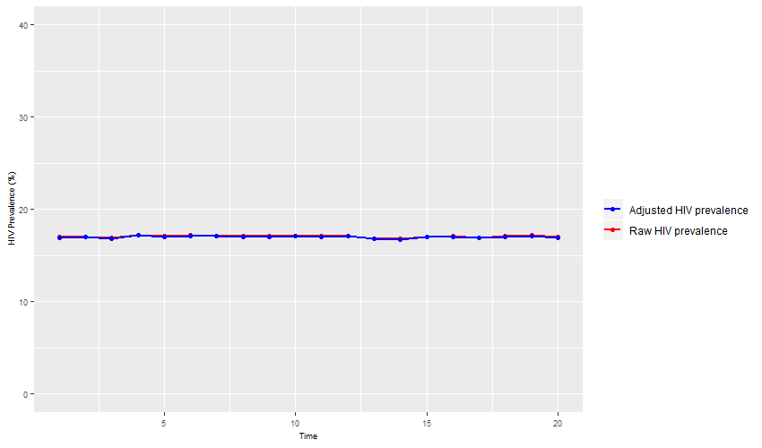

ANCRTAdjust
=======

Introduction
------------

In HIV-endemic countries, antenatal care sentinel surveillance (ANC-SS) has historically been used to monitor epidemiological trends in HIV prevalence over time.  Recently, several countries are transitioning from ANC-SS to the use of ANC routine testing (ANC-RT) data. Despite important advantages of using ANC-RT over conducting sentinel surveillance, the use of routinely collected program data raises concerns regarding data completeness and consistency. It is imperative that a clear and simple procedure be established for the use of such data so that valid conclusions can be drawn.

`ANCRTAdjust` is an R package that was developed to check and validate ANC-RT data. The specific functions have been designed to allow program managers using ANC-RT data to monitor HIV trends in endemic countries to use a standard protocol to:

1. Evaluate data quality and completeness;  
2. Perform data cleaning;  
3. Identify outlying observations; and,  
4. Perform adjustments for common data inconsistencies due to incomplete reporting periods, multiple testing, and/or imperfect testing coverage.  

A standard protocol for data validation, implemented across all countries providing ANC-RT data for monitoring HIV trends, will ensure that HIV prevalence estimates are consistent, reproducible and valid. After installation, we propose an 8-step approach to achieve this using functions implemented in the `ANCRTAdjust` package.


## Documentation

Further information on the `ANCRTAdjust` can be found below.
[](https://github.com/brittanyblouin/ANCRTAdjust/blob/master/docs/index.html)
[](https://github.com/brittanyblouin/ANCRTAdjust/blob/master/docs/reference/index.html)

Installation
------------

Install via Github using `devtools`:

``` r
# if devtools is not already installed, copy-paste the following: install.packages("devtools")
devtools::install_github("brittanyblouin/ANCRTAdjust")
library(ANCRTAdjust)
```
Once installed, we will load a simulated ANC-RT dataset and walk through the different steps required to clean and adjust ANC-RT data.

Step 1) Loading the ANC-RT data
----------------
For illustration purposes, we first load the supplied simulated ANC-RT dataset.

``` r
data(ancrt)
```

``` r
> head(ancrt)
  faciluid time n_clients n_status knownpos testpos testneg  true_prv snu1 year
1      F_1    1       217      217       29      37     151 0.3041475    1 2015
2      F_1    2       240      240       31      40     169 0.2958333    1 2015
3      F_1    3       216      216       30      38     148 0.3148148    1 2015
4      F_1    4       159      159       22      28     109 0.3144654    1 2015
5      F_1    5       192      192       25      32     135 0.2968750    1 2015
6      F_1    6       214      214       30      39     145 0.3224299    1 2016
```

Step 2) Verifying your database and naming your variables
---------------------
After loading the data, the next step is to make sure we are following the naming conventions for the most important variables. These include:

* `faciluid`: the unique facility identifier.   
* `time`: the calendar time over which the data was collected.   
* `n_clients`: the number of women from the specified facility, during the specified time period, that attended their first ANC visit.   
* `n_status`: the number of women from the specified facility, during the specified time period, that had their HIV status ascertained at their first ANC visit, either by testing or through previous knowledge of their status (if available). Note: If data is not available for `n_status` it will automatically be created with missing data for all observations.
* `knownpos`: the number of women from the specified facility, during the specified time period, that already knew that they were HIV-positive at their first ANC visit (if available).  Note: If data is not available for `knownpos` it will automatically be created with missing data for all observations.
* `testpos`: the number of women from the specified facility, during the specified time period, that tested positive for HIV at their first ANC visit (if available).  Note: If data is not available for `testpos` it will automatically be created with missing data for all observations.
* `testneg`: the number of women from the specified facility, during the specified time period, that tested negative for HIV at their first ANC visit (if available).  Note: If data is not available for `testneg` it will automatically be created with missing data for all observations.
* `totpos`: the number of women from the specified facility, during the specified time period, that were HIV-positive at their first ANC visit (if available).  Note: If data is not available for `totpos` it will automatically be created as the sum of `testpos` and `knownpos`.

Some data might be available age-disaggregated. If so, the variable should be named:

* `age`: age category of pregnant women.

Finally, data might be available for the sub-national unit 1 and for the year (allowing some results to be stratified by these variables).  If so, these variables should be named:

* `snu1`: The sub-national unit 1.
* `year`: The calendar year that the data was collected.

The function `check_data()` can automatically verify if you have the correct data structure and rename (if warranted) the variables for you (see `help(check_data)` for more information).

``` r
> ancrt <- check_data(ancrt, faciluid = "faciluid", time = "time", n_clients = 'n_clients', n_status = "n_status", knownpos = "knownpos", testpos = "testpos", testneg = "testneg", snu1 = "snu1", year = "year")
```

Step 3) Data cleaning
-------------
The third step is to clean the data using the `data_clean()` function. Full details on the data cleaning procedure implemented in this function can be found by typing `help(data_clean)` in your console. Briefly, the data is cleaned in the following ways:

* If any one of  `n_status`,  `testneg`,  `testpos`, `knownpos`,  or  `totpos` is missing for a particular observation, we can calculate it from the other variables (i.e., they are perfectly correlated).
* In cases where `n_status` > `n_clients` due to multiple testing, we can implement three adjustments: a) impute using the mean facility coverage, b) remove those observations, c) set testing coverage to 100%. In this case, the total number of women found to be living with HIV is also adjusted.
* If the total number of HIV-positive women (`totpos`) is higher than the number of women tested (`n_status`), we reclassify that observation as missing (`NA`).
* Finally, the data is checked for duplicates (i.e., more than one observation exists with the same `faciluid` and `time`).

``` r
ancrt_cleaned <- data_clean(ancrt)
```

Step 4) Descriptive graphs
------------------
An intuitive way to examine the impact of data cleaning and adjustment options is to plot the results. This is achieved using the `descriptive_plot()` function.

For example, the first plot below shows the overall proportion of facilities at each time point that exhibit two main types of data quality problems: a) the percent of observations with missing data for `n_clients`, `n_status_c` or `totpos_c` (in the cleaned data) and b) the percent of observations with invalid values for `n_clients`, `n_status`, `testpos` or `knownpos` (in the raw data).

The second graph shows how HIV testing coverage is affected by different possible types of adjustment for invalid testing coverage. Specifically, HIV testing coverage calculated from a) the raw data, b) the cleaned data, and using the three adjustment options for multiple testing: c) imputing invalid testing coverage value by the mean of the valid facility coverage estimates (impute option), d) removing invalid values (remove option), and e) replacing all HIV testing coverage higher than 100% by this value (set to maximum option).

Finally, the third plot shows temporal trends in HIV prevalence from ANC-RT data using the same options as for the second graph. In our simulated example here, we can see that all options provide similar estimates of HIV prevalence.

``` r
descriptive_plot(ancrt_cleaned)
``` 


Optional: Data quality indicators
-----------------------
It is important to assess the quality of the data.  Specifically, missing data and impossible values can have important effects on the validity of the results.  The function `quality_indicators()` will automatically calculate the following data quality indicators from the raw and cleaned data and output the results in a table:

* The number and % of facilities that don't report all quarters.
* The number and % of observations with missing data for each of: `n_clients`, `n_status`, `testpos`, `testneg` and `knownpos`.
* The number and % of observations with missing data for at least one of `n_clients`, `n_status`, or `totpos`.
* The number and % of observations with `n_status` > `n_clients` (HIV testing coverage > 100%).
* The number and % of observations with `n_status` < `totpos` (HIV prevalence > 100%).
* The number and % of observations with `n_status` < (`testpos` + `testneg` + `knownpos`).
* The number and % of observations with negative values for each of: `n_clients`, `n_status`, `testpos`, `testneg` and `knownpos`.
* The number and % of observations with invalid data for at least one of `n_clients`, `n_status`, `testpos`, or `knownpos`.

The data quality indicators can be calculated for the entire country dataset or stratified by region and/or time period (see `help(quality_indicators)` for more information).

``` r
ancrt_quality <- quality_indicators(ancrt_cleaned, by_region = FALSE, by_time = FALSE)
```
```r
> ancrt_quality
                              Raw.Count Raw.Percent Clean.Count Clean.Percent
Missing >=1 quarter                   0        (0%)          NA            NA
Missing n_clients                     0        (0%)           0          (0%)
Missing n_status                      0        (0%)           0          (0%)
Missing testpos                       0        (0%)           0          (0%)
Missing testneg                       0        (0%)           0          (0%)
Missing knownpos                      0        (0%)           0          (0%)
Missing >=1 variables                 0        (0%)           0          (0%)
Invalid coverage                    654     (3.27%)         650       (3.25%)
Invalid prevalence                    0        (0%)           0          (0%)
Inconsistent n_status               475     (2.38%)           0          (0%)
Negative n_clients                    0        (0%)           0          (0%)
Negative n_status                     0        (0%)           0          (0%)
Negative testpos                      1        (0%)           0          (0%)
Negative testneg                      0        (0%)           0          (0%)
Negative knownpos                     0        (0%)           0          (0%)
One or more invalid variables       886     (4.43%)         650       (3.25%)
```

Step 5) Flagging outliers
-----------------
It is possible that errors exist in the data and these may be detected by investigating outlier observations.  The function `flag_outliers()` will flag outliers for the variables `n_clients`, `n_status_c`, `testpos_c`, `testneg_c`, `knownpos_c`, `totpos_c`, `prv` and `cov`.  Outliers are defined as being more than two standard deviations greater than or less than the mean value.  The mean reference to which observations are compared can either be the facility-specific mean, the subnational unit 1-specific mean or the country-specific mean, according to user inputs.  The flagged data can either be output as the full dataset with additional variables indicating outlier observations, or a dataset that only includes data for outlier observations.  See `help(flag_outliers)` for more information.

``` r
outliers <- flag_outliers(ancrt_cleaned, flag_by = "facility", result = "outliers")
```

``` r
> head(outliers)
faciluid time n_clients n_status_c testpos_c testneg_c knownpos_c totpos_c       prv       cov
1      F_1    4       159        159        NA       109         NA       NA        NA        NA
2      F_1    7        NA         NA        NA        NA         37       NA        NA        NA
3      F_1   13        NA         NA        NA        NA         NA       NA        NA 0.9956140
4      F_1   14        NA         NA        NA        NA         NA       NA        NA 0.9954128
5      F_1   18        NA         NA        NA       104         NA       NA 0.3918129        NA
6     F_10   17        NA        243         8        NA          6       14        NA        NA
```

Step 6 ) Adjusting for invalid HIV testing coverage
------------------------------
If data quality indicators have indicated that some values are invalid, it is warranted to adjust them. Specifically, it is possible that testing coverage is higher than 100% if, following a first HIV negative test, subsequent tests at ANC visits are included (i.e., multiple testing). The `mt_adjust()` function can be used to adjust for this. There are three 4 different adjustment options that can be implemented if HIV testing coverage is >100%:

* `impute`:  replace `n_status_c` with the facility's mean testing coverage (only including valid coverage observations to calculate the mean) multiplied by `n_clients`.
* `remove`: replace `n_status_c` with a missing value (`NA`).
* `setmax`: replace `n_status_c` with `n_clients`.
* `none`: no adjustment is made.

The specific adjustment to be chosen depends on the hypothesized mechanism that generated these data inconsistencies. It is recommend to explore the impact of these different adjustment options using the graphical function detailed below. Consult the help file for more information by typing `help(mt_adjust)` in your console.

``` r
ancrt_cleaned <- mt_adjust(ancrt_cleaned, adjust_option = "setmax")
``` 

Step 7) Calculating HIV prevalence and HIV testing coverage (with and without adjustment for missing reporting period)
---------------------------------------------------
After data cleaning and adjustments, one could calculate HIV prevalence and testing coverage. The function `hiv_prv_cov()`  will calculate the raw HIV prevalence, the HIV prevalence adjusted for previous adjustments, and the HIV testing coverage. Note that these estimates are not adjusted for missing reporting periods or imperfect HIV testing coverage.  Results can be calculated stratified by the subnational units (`snu1`), the reporting period or the year according to user inputs. See `help(hiv_prv_cov)` for more information.

```r
> hiv_prv_cov(ancrt_cleaned, by_period = FALSE, by_snu1 = FALSE, by_year = FALSE)
  snu1 hiv_raw hiv_prv hiv_cov
1  All  17.07   17.11  95.55
```


Alternatively, if some facilities did not report data at certain time periods, the function `hiv_prv_ipcw()` can be used to adjust the HIV prevalence and HIV testing coverage for missing reporting periods (thereby reducing the possibility of selection bias) using inverse probability of censoring weighting (IPCW). Results can be calculated stratified by the subnational units, the reporting period or the year according to user inputs (see `help(hiv_prv_ipcw)` for more information). Specifically, the IPCW is calculated as follow:

\begin{align}
\ w & = & \frac{1}{P(\text{Not being censored } | \text{ facility})} \\
\end{align}

```r
> hiv_prv_ipcw(ancrt_cleaned)
  snu1 hiv_raw hiv_prv hiv_cov
1  all  17.07   17.11  95.55
```

Step 8) Adjusting HIV prevalence for imperfect testing coverage
-------------------------------------------------------
It has been found that selection bias can be introduced into HIV prevalence estimates due to imperfect HIV testing coverage (i.e. < 100% coverage). If the average testing coverage is low (i.e., <90%), it can be advised to adjust for these potential biases.

Using data from the *President Emergency Funds for AIDS Relief in Africa*'s (PEPFAR) *Monitoring, Evaluation, and Reporting* (MER) database, we estimated adjustment factors for each 1% point increase in HIV testing coverage. To do so, we used binomial logistic regression models with facility-level fixed effects and marginal standardization to assess the effect of testing coverage on HIV prevalence (see Maheu-Giroux *et al*. (2019) for details on the methods, applied to Malawi's ANC-RT data). The PEPFAR MER database contains information on more than 37 millions ANC attendees from 19,527 unique facilities from 17 countries in sub-Saharan Africa, totaling 226,541 observations over the 2015-2019 period. The figure below shows the estimated relationship between imperfect testing coverage and HIV prevalence (Fig 2)


The `impcov_adjust()` function can be used to implement this adjustment, after having used the the `data_clean()`, `mt_adjust()` functions. The `impcov_adjust()` function must be used on a data frame from either the  `hiv_prv_cov()` function - for estimates adjusted for missing reporting periods - or the `hiv_prv_ipcw()` function - for estimates adjusted for missing reporting periods. If results were reported stratified by the first subnational unit (`snu1`), the reporting period (`by_period = TRUE)` and/or the year (`by_year = TRUE`) in `hiv_prv_cov()` or `hiv_prv_ipcw()`, the adjustment for imperfect testing coverage will also be stratified by the same variable(s).  See `help(impcov_adjust)` for more information.

```r
> prv_cov <- hiv_prv_cov(ancrt_cleaned, by_snu1 = TRUE, by_period = FALSE, by_year = FALSE)
> results <- impcov_adjust(data = prv_cov)
```

```r
> results
snu1 hiv_raw hiv_prv hiv_cov adjusted_prv
1    1  15.89   15.93  95.74         15.84
2    2  17.44   17.48  95.52         17.38
3    3  18.14   18.17  95.33         18.05
```
Alternatively, if users want to examine the impact of this adjustment on selected observed HIV prevalence estimates at imperfect testing coverage, the same function can be use. To do so, imply enter the point estimate for HIV prevalence and HIV testing coverage and the adjusted prevalence will be outputted.

```r
> impcov_adjust(hiv_prv_point = 25, hiv_cov_point = 75)
[1] 23.59513
```

Step 9) Plotting raw and adjusted HIV prevalence over time
--------------------------------------------------
The final step is to examine the impact (if any) of the data cleaning and adjustments. Specifically, it can be useful to compare the raw HIV prevalence to the fully adjusted HIV prevalence (following data cleaning, adjustment for multiple testing, adjustment for missing reporting periods and adjustment for imperfect HIV testing coverage).  The easiest way to compare these is by plotting the raw and fully adjusted HIV prevalence over time.  The function `plot_rawadjusted()` will perform this task.  This function requires that you input the dataframe output by `impcov_adjust()` and that the results be stratified by reporting period or year.  Therefore, `by_period = TRUE` or `by_year = TRUE` must be specified in the `hiv_prv_cov()` or `hiv_prv_ipcw()` function, prior to running the `impcov_adjust()` function.  See `help(plot_rawadjusted)` for more information.

```r
> prv_cov <- hiv_prv_ipcw(ancrt_cleaned, by_snu1 = FALSE, by_period = TRUE, by_year = FALSE)
> results <- impcov_adjust(prv_cov)
> plot_rawadjusted(results, snu1 = "all", time_unit = "period", hiv_raw = TRUE, y_lim = 40)
```


Community Guidelines
--------------------

Contributions to the software are welcome and can be made as pull requests to the branch master.  Issues or problems with the software can be reported and support can be obtained in the project's Github page or by e-mailing brittany.blouin@mail.mcgill.ca.  
