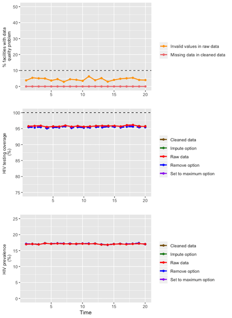

ANCRTAdjust
=======
R Package to adjust antenatal care routine HIV testing (ANC-RT) data to reduce bias in estimating HIV prevalence trends

Installation
------------

Install via Github using `devtools`:

``` r
devtools::install_github("brittanyblouin/ANCRTAdjust")
```

Loading the data
----------------
We can then try the package using a syntethetic dataset that we first load.

``` r
data(ancrt)
```

``` r
> head(ancrt)
  faciluid time n_clients n_status knownpos testpos testneg  true_prv snu1
1      F_1    1       217      217       29      37     151 0.3041475    1
2      F_1    2       240      240       31      40     169 0.2958333    1
3      F_1    3       216      216       30      38     148 0.3148148    1
4      F_1    4       159      159       22      28     109 0.3144654    1
5      F_1    5       192      192       25      32     135 0.2968750    1
6      F_1    6       214      214       30      39     145 0.3224299    1
```

Naming your variables
---------------------
After loading the data, the first step is to make sure we are following the naming conventions for the most important variables. These include:

- `faciluid`: the unique facility identifier.   
- `time`: the calendar time over which the data was collected.   
- `n_clients`: the number of women from the specified facility, during the specified time period, that attended their first ANC visit.   
- `n_status`: the number of women from the specified facility, during the specified time period, that had their HIV status ascertained at their first ANC visit, either by testing or through previous knowledge.
- `knownpos`: the number of women from the specified facility, during the specified time period, that already knew that they were HIV-positive at their first ANC visit.
- `testpos`: the number of women from the specified facility, during the specified time period, that tested positive for HIV at their first ANC visit.
- `testneg`: the number of women from the specified facility, during the specified time period, that tested negative for HIV at their first ANC visit.
- `totpos`: the number of women from the specified facility, during the specified time period, that were HIV-positive at their first ANC visit (if available).  NOTE: If data is not available for `totpos` it will automatically be created as the sum of `testpos` and `knownpos`.

Some data might be available age-disaggregated. If so, the variable should be named:

* `age`: age category of pregnant women.

Finally, data might be available for the sub-national unit 1 and for the year (allowing some results to be stratified by these variables).  If so, these variables should be named:

* `snu1`: The sub-national unit 1.
* `Year`: The calendar year that the data was collected.

The function `name_var()` can automatically rename the variables for you (see `help(name_var)` for more information).

``` r
ancrt <- name_var(ancrt, faciluid = "faciluid", time = "time", n_clients = "n_clients",
                  n_status = "n_status", knownpos = "knownpos", testpos = "testpos",
                  testneg = "testneg", snu1 = "snu1") 
```

Data cleaning
-------------
The second step is to clean the data using the `data_clean()` function. The data cleaning process used in this function can be found by typing `help(data_clean)` in your console.

``` r
ancrt_cleaned <- data_clean(ancrt)
```

Descriptive graphs
------------------
An inuitive way to examine the impact of data cleaning and adjustment options is to plot the results. This is achieved using the `descriptive_plot()` function.

``` r
descriptive_plot(ancrt_cleaned)
``` 


Data quality indicators
-----------------------
It is important to assess the quality of the data.  Specifically, missing data and impossible values can have important effects on the validity of the results.  The function `quality_indicators()` will automatically calculate the following data quality indicators from the raw and cleaned data and output the results in a table:

* The number and % of facilities that don't report all quarters.
* The number and % of observations with missing data for each of: `n_clients`, `n_status`, `testpos`, `testneg` and `knownpos`.
* The number and % of observations with missing data for at least one of `n_clients`, `n_status`, or `totpos`.
* The number and % of observations with `n_status` > `n_clients` (HIV testing coverage > 100%).
* The number and % of observations with `n_status` < `totpos` (HIV prevalence > 100%).
* The number and % of observations with `n_status` < (`testpos` + `testneg` + `knownpos`).
* The number and % of observations with negative values for each of: `n_clients`, `n_status`, `testpos`, `testneg` and `knownpos`.
* The number and % of observations with invalid data for at least one of `n_clients`, `n_status`, `testpos`, or `knownpos`.

The data quality indicators can be calculated for the entire country dataset or stratified by region and/or time period (see `help(quality_indicators)` for more information).

``` r
ancrt_quality <- quality_indicators(ancrt_cleaned, byregion = FALSE, bytime = FALSE)
```
```r
> ancrt_quality
                              Raw.Count Raw.Percent Clean.Count Clean.Percent
Missing >=1 quarter                   0        (0%)          NA            NA
Missing n_clients                     0        (0%)           0          (0%)
Missing n_status                      0        (0%)           0          (0%)
Missing testpos                       0        (0%)           0          (0%)
Missing testneg                       0        (0%)           0          (0%)
Missing knownpos                      0        (0%)           0          (0%)
Missing >=1 variables                 0        (0%)           0          (0%)
Invalid coverage                    654     (3.27%)         650       (3.25%)
Invalid prevalence                    0        (0%)           0          (0%)
Inconsistent n_status               475     (2.38%)           0          (0%)
Negative n_clients                    0        (0%)           0          (0%)
Negative n_status                     0        (0%)           0          (0%)
Negative testpos                      1        (0%)           0          (0%)
Negative testneg                      0        (0%)           0          (0%)
Negative knownpos                     0        (0%)           0          (0%)
One or more invalid variables       886     (4.43%)         650       (3.25%)
```

Adjusting HIV testing coverage
------------------------------
It is possible that testing coverage is higher than 100% if, following a first HIV negative test, subsequent tests at ANC visits are included (i.e. multiple testing). The `mt_adjust()` function can be used to adjust for this. There are three 3 different adjustment options. Consult the help file for more information by typing `help(mt_adjust)` in your console.

``` r
ancrt_cleaned <- mt_adjust(ancrt_cleaned, adjust_option = 'setmax')
``` 

Flagging outliers
-----------------
It is possible that errors exist in the data and these may be detected by investigating outlier observations.  The function `flag_outliers()` will flag outliers for the variables `n_clients`, `n_stat`, `TestPos`, `TestNeg`, `KnownPos`, `TotPos`, `Prv` and `Cov`.  Outliers are defined as being more than two standard deviations greater than or less than the mean value.  The mean reference to which observations are compared can either be the facility-specific mean, the subnational unit 1-specific mean or the country-specific mean, according to user inputs.  The flagged data can either be output as the full dataset with additional variables indicating outlier observations, or a dataset that only includes data for outlier observations.  See `help(flag_outliers)` for more information.

``` r
outliers <- flag_outliers(ancrt_cleaned, flagby = "facility", result = "outliers")
``` 

``` r
> head(outliers)
  faciluid time n_clients n_stat TestPos TestNeg KnownPos TotPos       Prv       Cov
1      F_1    4       159    159      NA     109       NA     NA        NA        NA
2      F_1    7        NA     NA      NA      NA       37     NA        NA        NA
3      F_1   13        NA     NA      NA      NA       NA     NA        NA 0.9956140
4      F_1   14        NA     NA      NA      NA       NA     NA        NA 0.9954128
5      F_1   18        NA     NA      NA     104       NA     NA 0.3918129        NA
6     F_10   17        NA    243       8      NA        6     14        NA        NA
```

Calculating HIV prevalence and HIV testing coverage
---------------------------------------------------
The function `HIV_prev_cov()`  will calculate the HIV prevalence and HIV testing coverage using the variables `n_clients`, `n_stat` and `TotPos`.  Note that these estimates are not adjusted for missing reporting periods or imperfect HIV testing coverage.  Results can be calculated stratified by the subnational unit 1, the reporting period or the year according to user inputs (see `help(HIV_prev_cov)` for more information).

```r
HIV_prev_cov(ancrt_cleaned, byperiod = "FALSE", bysnu1 = "FALSE", byyear = "FALSE")
[1] 17.11 95.55
```

Calculating HIV prevalence adjusted for missing reporting periods
-----------------------------------------------------------------
In the event that some facilities did not report data at certain time periods, the function `HIVprev_ipcw()` can be used to adjust the HIV prevalence for missing reporting periods (thereby reducing a possible selection bias) using inverse probability of censoring weighting.  Results can be calculated stratified by the subnational unit 1, the reporting period or the year according to user inputs (see `help(HIV_prev_cov)` for more information).

```r
HIVprev_ipcw(ancrt_cleaned, byperiod = "FALSE", bysnu1 = "FALSE", byyear = "FALSE")
[1] 17.11
```